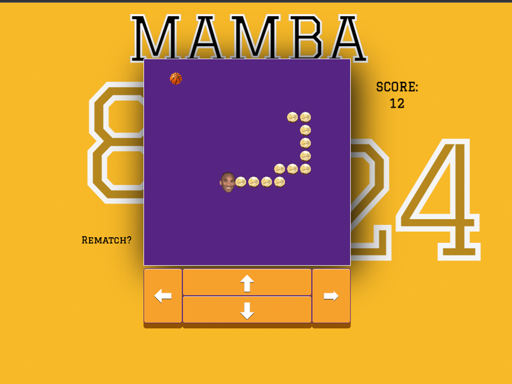
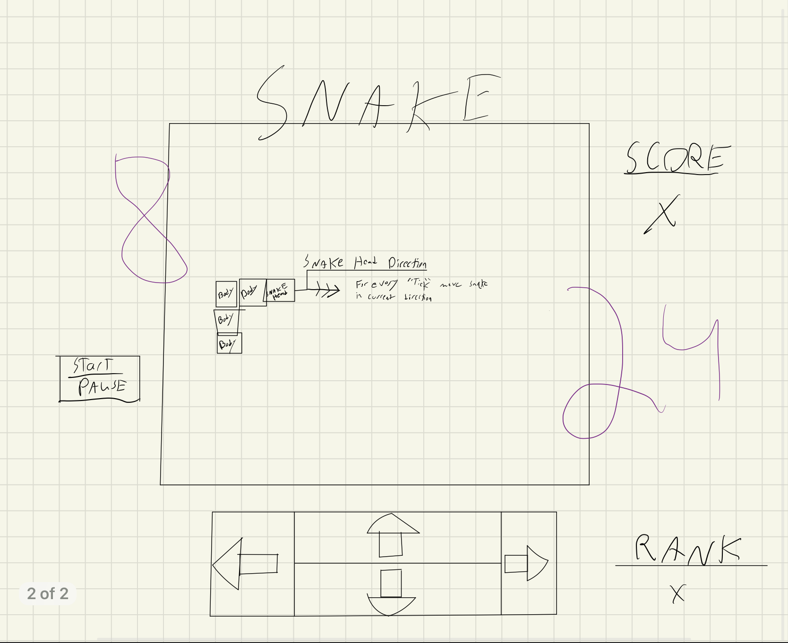

# MAMBA

A take on the classic game of Snake. Players help NBA legend Kobe Bryant, aka, "Black Mamba"  secure as many NBA Championship Trophies as possible without getting a technical foul!

## Getting Started 🐍

Use your keyboard arrow keys or the on screen buttons to start the game and change directions. The game will end if you run into a wall or Kobe's trophies.

# [Play Mamba Here!](https://harrison-snake.netlify.app/)

## Technologies Used 💾

- HTML
- CSS
- JavaScript

## Planning Matrial 📕

## [Original game pseudocode](https://docs.google.com/document/d/1TEJkIB5uubCW0JDVM64F5_dmlGbBcCfhMJ09kc_D4AM/edit)
The image below was the original layout of the game:

## Ice Box 🧊

- [ ] Update rematch button
- [ ] Basketball animations
- [ ] Kobe face turns on direction change
- [ ] Difficulty settings
- [ ] Highscore tracker 
- [ ] Pause function
- [ ] Additional audio

## Credits 🙌

Special thanks to @jemware for the button design.

## Known Bugs 🛠️

- Sound loop on body crash after using Rematch button
- [FIXED] Flashing snake head on mobile
- [FIXED] Sqr #255 detection issue 